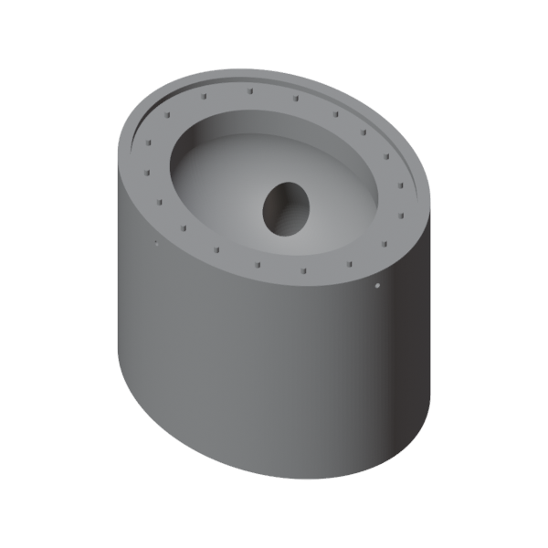
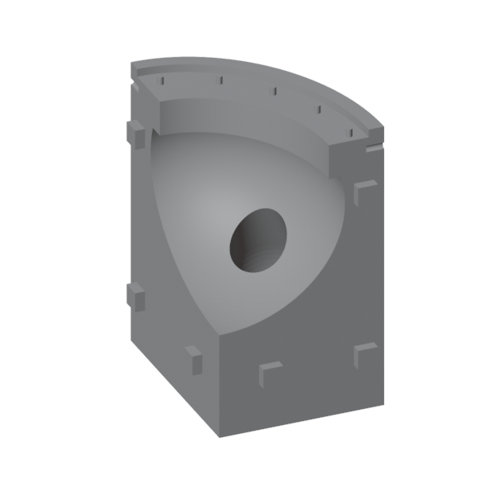
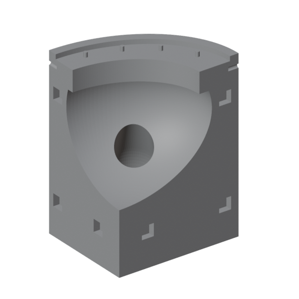
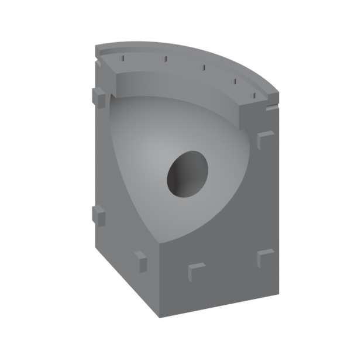
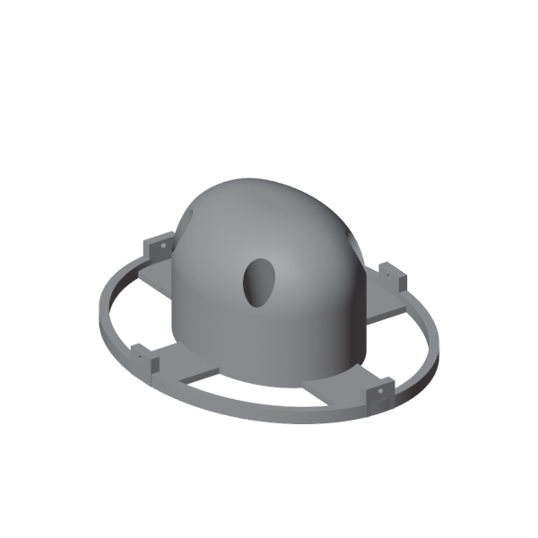
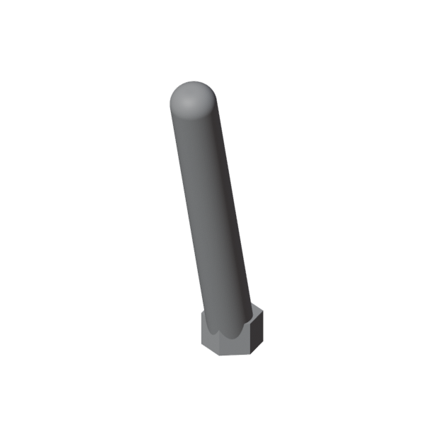
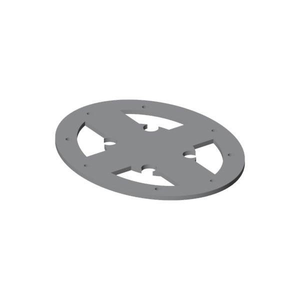
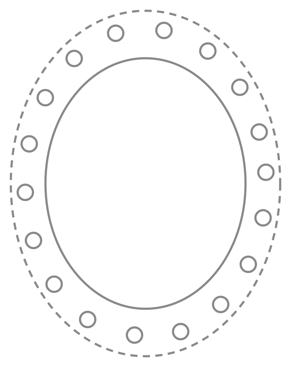

# Make Magazine files

Files for the Make Magazine article on building the silicone udder controller. The article covers the udder itself, not the cow-shaped cabinet around it.

## Files

Click a picture or file name to open it on GitHub, where you can spin the model around and download it.

| Preview | File | What it is | Print or cut |
|---|---|---|---|
|  | [`udder_moldbox_1pc.stl`](udder_moldbox_1pc.stl) | One-piece mold box for casting the silicone. Needs a print bed of at least 166 × 209 × 146 mm. | 1 |
|  | [`udder_moldbox_4pc_tl_pegs.stl`](udder_moldbox_4pc_tl_pegs.stl) | Top-left quadrant of the four-part mold box, with pegs. About 83 × 104 × 146 mm. | 1 |
|  | [`udder_moldbox_4pc_tr_sockets.stl`](udder_moldbox_4pc_tr_sockets.stl) | Top-right quadrant, with sockets. | 1 |
|  | [`udder_moldbox_4pc_bl_sockets.stl`](udder_moldbox_4pc_bl_sockets.stl) | Bottom-left quadrant, with sockets. | 1 |
|  | [`udder_moldbox_4pc_br_pegs.stl`](udder_moldbox_4pc_br_pegs.stl) | Bottom-right quadrant, with pegs. | 1 |
|  | [`udder_inset.stl`](udder_inset.stl) | Insert that sits in the mold box and forms the inside of the udder. | 1 |
|  | [`udder_inset_pole.stl`](udder_inset_pole.stl) | Pole that forms the hollow inside each teat. | 4 |
|  | [`udder_topbrace.stl`](udder_topbrace.stl) | Optional brace that holds in the expanding foam and helps when mounting the udder. | 1 |
|  | [`udder_baseboard_cutout.dxf`](udder_baseboard_cutout.dxf) | Cutting template for the board the udder mounts to. Units are millimeters. | 1 |
| | [`fsrTeatTest/fsrTeatTest.ino`](fsrTeatTest/fsrTeatTest.ino) | Sketch for testing the four FSRs before and after casting the foam. | — |

Print the four-part mold even if you cast the silicone in the one-piece mold. The foam is cast in the four-part mold, since the finished udder can't come back out of the one-piece one.

The four-part mold is the one-piece mold cut along its center lines, so each quadrant holds one whole teat. The top-left and bottom-right quadrants have three 10 mm square pegs on each cut face, and the other two have matching sockets with 0.2 mm of clearance per side. Each quadrant is different, so print one of each and match pegs to sockets when you assemble it.

## Printing

The molds aren't functional parts, so print them fine and hollow: about 0.16 mm layers for a smooth cast and about 5% infill.

The insert screws to the mold box with 4 × M3x10 screws so it can't float up while the silicone cures.

## Mounting template

`udder_baseboard_cutout.dxf` has two ellipses and 18 holes:

- **Inner ellipse (111.9 × 140.0 mm):** cut this out. The udder hangs through it.
- **Outer ellipse (150.7 × 193.1 mm):** don't cut. It marks where the silicone lip ends, so you can see how much board the udder covers.
- **18 holes (8.56 mm):** for threaded inserts that take the 18 × M6x8 screws.

The template assumes a 3/4" board. The original is cut from MDF.

## Testing the FSRs

`fsrTeatTest.ino` reads four FSRs on A0–A3 and prints each reading to the serial monitor at 9600 baud, labeled by jumper wire color (white, green, yellow, orange). Wire one lead of each FSR to 3.3V and the other to its analog pin, with a pull-down resistor from the pin to ground. The article uses 5.1kΩ; anything from 4.7kΩ to 22kΩ works.

Readings go up as you squeeze. Uncomment the check at the bottom of `loop()` and adjust `THRESHOLD` until a squeeze prints `White PRESSED!` and resting doesn't. Copy the check for the other three colors.

## Using it as a game controller

Once the readings look right, flash [`teensy/fsr_udder/fsr_udder.ino`](../teensy/fsr_udder/fsr_udder.ino). It turns each teat into a keyboard key, so the udder works with anything that takes keyboard input.

**Try it out by playing Udder Mayhem in your browser: https://karomancer.github.io/uddermayhem/**

In the Arduino IDE with Teensyduino, set **Tools → USB Type** to **Keyboard** (or any option that includes Keyboard) before uploading. The sketch won't compile without it.

| Teat | Pin | Key |
|---|---|---|
| Front left | A0 | A |
| Back right | A1 | W |
| Front right | A2 | S |
| Back left | A3 | Q |

`THRESHOLD` (900) is the one value to tune. If a teat never registers, lower it. If it fires without being squeezed, raise it.
